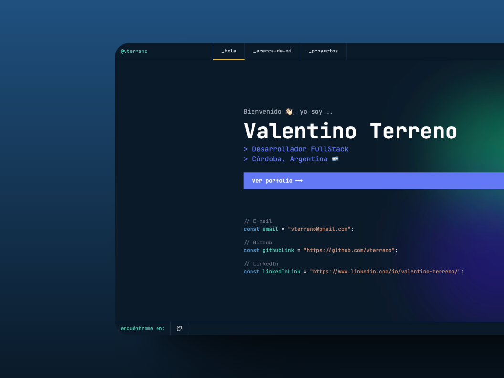

# 🚀 Porfolio para desarrolladores


<div align="center">
<a href="https://devporfolionext.netlify.app/">

</a>
<p></p>
</div>

<div align="center">


</div>

## 🔧 Instalación

Instala las dependencias

```
npm install
```

Inicia el proyecto en modo desarrollo

```
npm run dev
```

## 🤝 Cómo contribuir

1. Haz un fork del proyecto 
2. Crea una rama para tu feature, por ejemplo: (`git checkout -b feature/AmazingFeature`)
3. Haz commit de tus cambios, por ejemplo: (`git commit -m 'Add: AmazingFeature'`)
4. Haz push hacia la rama, por ejemplo (`git push origin feature/AmazingFeature`)
5. Abre una pull request detallando los cambios desarrollados.

## 📋 Estándares de código

### Commits

En la medida de lo posible, describe tus commits para que los colaboradores los puedan analizar de una forma más rápida y eficiente.

- `feat:` - Nuevas características.
- `fix:` - Correcciones de bugs.
- `docs:` - Cambios en la documentación.
- `style:` - Cambios que no afectan el código (espacios, formato, etcétera).
- `refactor:` - Refactorización del código.
- `test:` - Añadir o modificar tests.
- `chore:` - Cambios en el proceso de build o herramientas auxiliares.

Ejemplo: `feat: add newsletter subscription component`

### Pull requests

- Describe claramente los cambios realizados.
- Incluye capturas de pantalla si hay cambios visuales.
- Referencia los issues relacionados, en caso de que existan.
- Mantén los PR pequeños y enfocados en una sola característica.

## Colaboradores

(Pendiente...)
